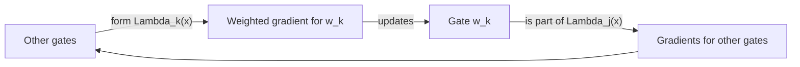

# Layers as Lenses - a learning guide

> **Purpose.** This is the one-stop orientation document for the Layer Lenses
> project. It explains the research question, formal setup, mechanism,
> experiments, implementation, and open gaps. Read the preprint as the
> authoritative scientific source; use this guide to navigate it and the code.

## 1. Start here: the claim in one paragraph

The project asks a mechanistic question: **why can end-to-end gradient descent
find useful features in a deep network, starting from random weights?** The
paper's proposed answer is *layers as lenses*. When a neuron is updated, the
other gated layers multiply its gradient by an input-dependent weight. They
therefore act like a lens that makes some examples more important than others.
The neuron is simultaneously (1) a separator trained on this reweighted data
and (2) a component of the lens used to train other neurons. This circular
dependence can create positive feedback: a small, initially accidental movement
toward a local feature can make another, broader feature become learnable, and
the latter can reinforce the former.

The paper makes this argument rigorously only for a deliberately simple model
(a single-path DLGN) and a structured synthetic target (an orthogonal oblique
decision tree). It then provides empirical evidence in wider DLGNs and ReLU
MLPs. Do not overstate the result: it is a compelling mechanism and a set of
controlled findings, **not** a theorem that all deep networks learn features in
this way.

## 2. What to read, in order

| Order | Source | What to get from it |
|---|---|---|
| 1 | [Layers as Lenses preprint](../Relevant%20Documents/Layers_as_Lenses_preprint.pdf) pp. 1-3 | The puzzle, the ODT data model, and DLGN notation. |
| 2 | Preprint pp. 4-6 | Lens/Blinder/Residue gradient factorisation and the two theorems. This is the intellectual core. |
| 3 | Preprint pp. 7-9 | Multi-path behavior, regularize-prune-retrain, hierarchy, and ReLU evidence. |
| 4 | [June 2026 slides](../Relevant%20Documents/Layers_lenses_June_2026_slides.pdf), slides 13-28 | Visual intuition for the data, architecture, and two lens effects. |
| 5 | Slides 30-50 | Single-path trajectory, prediction-from-initialization, multi-path optimization, and feature-emergence animation. |
| 6 | Slides 52-54 | Explicit work-in-progress extensions and optimization ideas. |
| 7 | [research spec](research_spec.md) and [paper mismatch log](paper_mismatches.md) | What this repository chooses when paper, notebook, and code differ. |
| 8 | `src/layer_lenses/` | The current reimplementation, which is not yet a complete paper reproduction. |

### Vocabulary that prevents confusion

- **Paper 1** means *Deep Networks Learn Features from Local
  Discontinuities in the Label Function* (the older, related work kept under
  legacy material).
- **Paper 2 / preprint** means *Layers as Lenses: Understanding Feature
  Learning via Positive Feedback in Gated Deep Networks* in `Relevant Documents`.
- **ODT / COB-ODT** means a complete, orthogonal, balanced oblique decision
  tree. Its decision hyperplanes are the ground-truth features.
- **DLGN-SF** is the shallow-features DLGN: every gate reads raw input `x`.
  Paper 2 calls its model “DLGN”; Paper 1 reserves “DLGN” for a more general,
  deeply parameterized model. This repository uses Paper 1’s naming, so the
  implemented model is `DLGNSF`.
- **Gating vector / ODT normal / decision vector** are all vectors in input
  space. Alignment means a large absolute cosine similarity between them.
- **Leaf node** is unfortunately overloaded. In the paper’s indexing, a
  “leaf node” can be the last *decision* node; it is followed by terminal
  **label nodes**. The code instead calls the terminal positions “leaves.”
  Always check the convention before comparing indices.

## 3. The scientific puzzle and why the setting is artificial on purpose

Expressivity says that deep networks *can* represent complicated functions.
The neural tangent kernel describes an infinite-width, nearly fixed-feature
limit. Neither by itself explains how a finite, randomly initialized network
changes its internal directions to find the relevant features. The project
therefore chooses a setting in which “the right feature” is observable: every
ground-truth decision boundary has a known normal vector.

The tradeoff is intentional:

| Component | Why it is useful | What it does not claim |
|---|---|---|
| COB-ODT labels | It has a known hierarchy of localized discontinuities and exact feature vectors `u_i`. | Natural data are not literally generated by trees with mutually orthogonal splits. |
| Sigmoidal DLGN gates | They preserve cross-layer products but make a neuron-level gradient analyzable. | The architecture is not a standard transformer/CNN/ordinary ReLU MLP. |
| Single-path model | It isolates interactions among `L` gate vectors. | It cannot solve the whole ODT classification task. |
| Population gradient flow | It supports clean sign arguments and symmetry reasoning. | It is not minibatch Adam on finite data. |

This is the correct lens for reading the work: it identifies a candidate
mechanism in a transparent testbed, then asks whether traces of it survive in
more realistic models.

## 4. The data model: COB-ODT

### 4.1 Tree and labels

Inputs are sampled uniformly from the unit sphere, `x ~ Unif(S^{d-1})`. A
complete binary tree has a decision vector `u_i` at every internal node. The
vectors are unit norm and mutually orthogonal. At node `i`:

- go left when `u_i^T x < 0`;
- go right otherwise;
- after the path’s decisions, assign the terminal leaf’s label `y*(x) in
  {-1, +1}`.

For paper depth `D`, the paper uses internal decision nodes `0` through
`N = 2^D - 2`, where the root is `0`, children are `2i+1` and `2i+2`, and the
last decision level is called “leaf nodes.” Terminal label nodes are numbered
`N+1` through `2N+2`. A depth-4 example has decision vectors `u_0` through
`u_14`, then 16 terminal labels (preprint p. 3, Figure 1).

The target can be expressed as a sum over root-to-label paths `gamma`:

```text
y*(x) = sum_gamma y*(gamma) product_{p=1}^D 1[tau_p u_{gamma_p}^T x > 0].
```

Exactly one path indicator is nonzero for each `x`.

### 4.2 Scope of discontinuity = the paper’s hierarchy

The root direction is globally important: crossing the root boundary changes
labels over a large part of the input distribution. A direction deeper in the
tree matters only within the region that reaches that node. For a balanced tree,
the scope shrinks by roughly a factor of two at each level. The preprint uses
this as an empirical definition of **hierarchical feature discovery**: capturing
root directions before their descendants means discovering broad discontinuities
before increasingly local ones.

This “scope” concept is more important than the literal tree. A future
generalization would need a way to define localized label discontinuities even
when no true tree is available.

### 4.3 Repository implementation

`src/layer_lenses/odt.py` creates the data used by current experiments:

- `_sample_unit_sphere` normalizes Gaussian draws;
- `_sample_orthonormal_vectors` uses QR to form the `u_i` normals;
- zero biases are used;
- `_traverse_tree` uses heap-style indices;
- labels alternate deterministically by terminal-leaf index, with an optional
  global sign flip; siblings are opposite;
- `threshold` removes points close to any decision hyperplane;
- `samples_reaching_node` and `odt_leaf_ids_for_x` expose tree membership for
  analyses.

The deterministic alternating label choice is a repository convention, not a
fully specified paper detail. See [paper_mismatches.md](paper_mismatches.md).

## 5. DLGN architecture: the object being analyzed

### 5.1 Mathematical model

For a path `pi`, the DLGN output is

```text
y_hat(x) = sum_{pi in Pi} a_pi product_{ell=1}^L phi(w_{pi,ell}^T x),
phi(t) = sigmoid(beta t).
```

With width `M`, `Pi = [M]^L`: every path selects one neuron per hidden layer.
Gate vectors are shared across paths: `w_{pi,ell}` depends only on the selected
neuron at layer `ell`. The value/path coefficients are products of edges in an
associated deep-linear value network. Consequently, the model is evaluated by
layerwise operations instead of explicitly summing `M^L` paths (preprint pp. 3-4).

The crucial structure is the **product** of gate activations. A change to one
gate changes which inputs are emphasized in gradients for the others.

### 5.2 Single path versus multi-path

The single-path model is

```text
y_hat(x; a, W) = a product_{ell=1}^L phi(w_ell^T x).
```

It can specialize to a single ODT path but cannot classify the complete ODT
well; with `M=1`, it improves only a `2^-D` fraction of data. Its purpose is
not accuracy, but theory. Multi-path DLGN (`M > 1`) has sufficient parallel
paths to cover the full problem and is used for the optimization experiments.

### 5.3 Code mapping

[`dlgn.py`](../src/layer_lenses/dlgn.py) implements `DLGNSF`:

- each `gating_layers[l]` is a linear map from raw `x` to a gate, followed by
  `sigmoid(beta * score)`;
- `value_layers` provide the multiplicative value network;
- `value_input_mode="x"` is the paper-faithful deep-linear input, whereas the
  legacy-compatible default `"ones"` starts it from an all-ones tensor;
- gates are bias-free by default;
- the output is multiplied by two to match a legacy `[-z, z]` softmax setup
  when this implementation uses a single BCE logit. That is a compatibility
  detail, not a paper equation.

The code has direct gating weights, so it implements **DLGN-SF**, not Paper
1’s general deep-gating parameterization.

## 6. The core derivation: residue, lens, blinder, separator

For logistic loss `L(y_hat) = log(1 + exp(-y* y_hat))`, the negative gradient
for the `k`-th gate vector of a single-path model factors as

```text
-nabla_{w_k} L
= E[ sigma(-y* y_hat(x))  Lambda_k(x)  phi'(w_k^T x)  y* a x ],

Lambda_k(x) = product_{kappa != k} phi(w_kappa^T x).
```

Read the four terms from left to right:

| Term | Name | Role |
|---|---|---|
| `sigma(-y* y_hat)` | Residue | How much prediction error remains. |
| `Lambda_k` | Lens | The product of all *other* gates; an input-dependent importance weight. |
| `phi'(w_k^T x)` | Blinder | The current gate’s sensitivity; it suppresses points where this gate is saturated. |
| `y* a x` | Separator direction | A perceptron-like signed input direction. |

So `w_k` acts as a separator, but not on the raw data distribution. It sees
data reweighted by Residue-Lens-Blinder (RLB). At the same time, `w_k` appears
inside the lenses `Lambda_j` of every other layer. That is the feedback loop:



The slides call this the neuron’s two roles: **separator for RLB-weighted
data** and **lens component for other layers** (slide 24). This is the paper’s
main explanatory move.

## 7. What the two theorems actually say

Both results concern a second-order question: how does moving gate `w_l` a
small amount alter the gradient on a *different* gate `w_k`? They assume
orthogonality conditions intended to approximate high-dimensional random
initialization and use population gradient flow.

### 7.1 Hierarchy-seeking lens (Theorem 3.1)

If one gate moves along a final-level ODT direction `u_j`, it increases the
other gate’s gradient toward any ancestor `u_i` of `j`, with the sign chosen
according to which subtree contains `j`. The effect also holds after swapping
the two directions/layers.

Intuition: a small movement that distinguishes a local leaf region modifies the
lens. That reweighting makes a broader ancestor boundary visible to another
neuron, even if the raw first-order gradient had essentially no component in
that ancestor direction. Once the ancestor is learned, it can in turn improve
the lens for the local feature: positive feedback.

**Important correction to a common first reading:** “hierarchy-seeking” does
not say the raw first-order gradient finds the root first. In the symmetric
single-path story it initially moves toward a leaf-node combination/saddle; the
second-order interactions then amplify root, child, and later directions in a
structured sequence.

### 7.2 Self-opposing lens (Theorem 3.2)

For a spurious direction `h` orthogonal to all true ODT vectors, if one gate
moves along `h`, another tends to be pushed along `-h`. Each may appear to
correct the other, but their irrelevant components grow in opposite directions.

This is not benign cancellation. In a wide multi-path network, many such
couplings can consume capacity in high-norm directions that do not align with
any ODT normal. The theorem supplies the paper’s mechanistic motivation for
gating L2 regularization and pruning.

### 7.3 Scope and limits of the theorems

The theorems are not claims about all of training. They require distinct layers,
specific orthogonality conditions, `0 < a < 1`, and the ODT distribution. The
paper says continuity makes the qualitative signs informative near, rather than
only at, exact orthogonality. Its experiments use them as a guide to interpret
trajectories; they do not prove full finite-data optimizer dynamics.

## 8. Single-path trajectory and initialization prediction

For a depth-4 tree and `L=4`, the paper studies `a=1` and a carefully chosen
small perturbation around the symmetric point `W=0`. The model first approaches
a saddle composed of last-level directions. Then the predicted temporal story
is roughly:

1. A perturbation along local directions such as `-u_7`, `-u_8` changes the
   lens.
2. `w_1` gains a strong push toward `-u_0` (root).
3. Once the root develops, `w_2` gains a push toward `-u_1` (child).
4. Other gates remain specialized to local directions, yielding a solution
   resembling two adjacent positive ODT paths.

The converged example is approximately
`[-u_0, -u_1, -u_7 + 0.3u_3, -u_8 - 0.3u_3]` in layer order. The paper encodes a
solution by the ODT index most aligned with each layer. For `D=L=4`, symmetries
give 96 canonical parameter-space solutions.

### Prediction from random initialization

The paper constructs a heuristic score for each candidate solution from three
parts: proximity to initialization, hierarchy-seeking support (`c_HS`), and
self-opposing support (`c_SO`). Across the selected 368 “deterministic”
initializations, the best coefficients `(c_SO, c_HS) = (0.7, 0.4)` predict
179/368 (49%) final solutions in a 96-way task. Proximity alone obtains 13%;
forcing out HS or SO reduces the best result to 28% or 36%, respectively.

This is evidence for the mechanism, not an exact solution-selection theorem.
The natural reading is: second-order lens effects add predictive signal beyond
geometric closeness to a solution.

## 9. Multi-path DLGN: from mechanism to an optimization intervention

The multi-path paper experiment uses `d=100`, depth-5 ODT, `L=5`, `M=16`.
Plain log-loss training reaches good but imperfect classification. The key
diagnostic scatter has:

- x-axis: norm of a gate vector;
- y-axis: its maximum absolute cosine with any true `u_i`;
- color: level of the closest ODT node.

The desirable upper-right region is large norm plus high alignment. Plain
training has some high-norm, low-alignment vectors: visible evidence of capacity
in spurious directions.

### Two-phase recipe

1. **Phase 1:** optimize with L2 penalty on gating vectors.
2. **Prune:** zero rows whose gate norm is below a threshold and hold them at
   zero.
3. **Phase 2:** restart without the L2 penalty, retaining the aligned,
   nonzero gates and allowing their norms to grow.

The preprint’s one example reports approximately 17% test error for standard
training, 13% with regularization, and 6% after prune/retrain. Over 10 seeds it
reports 17.8% +/- 0.7%, 13% +/- 0.7%, 8.9% +/- 0.7% for restart without
pruning, and 6% +/- 0.7% after pruning. These values belong to the paper’s
specific experiment; do not use them as a pass/fail target for a different
implementation unless settings are matched exactly.

### Capture epoch

For ODT direction `u_j`, its **capture epoch** is the first epoch at which at
least one gate has both a sufficiently large norm and sufficiently high cosine
alignment. The paper gives example thresholds norm `> 2.5`, cosine `> 0.8`.
Parent directions tending to be captured earlier than children is the central
multi-path hierarchy observation.

## 10. ReLU evidence: promising, but not yet the same theory

The preprint reports that ReLU MLPs with at least two hidden layers attain
similar ODT performance and show a similar ordering of first-layer capture
epochs. It also projects first-layer updates onto the subspace orthogonal to a
chosen ODT direction `u_j`. This reduces performance and alignment inside
`j`’s subtree, consistent with internal features facilitating descendant
features.

For a first-layer ReLU neuron, comparing its row weight to `u_i` is direct. For
a deeper ReLU neuron, its input-space decision boundary depends on earlier
activation masks; there is no single global `w` analogous to a DLGN-SF gate.
The research spec proposes an input-dependent effective gate normal and a
path-summed back-propagated ReLU lens. These are **research hypotheses and
planned analyses**, not results established by the preprint.

The current repository supports several first steps:

- `ReLUMLP`: bias-free fully connected ReLU classifier;
- `first_layer_odt_alignment`: norm/cosine diagnostics against true ODT
  normals;
- `plot_first_layer_odt_alignment`: paper-style scatter;
- `ReLUTrainConfig.first_layer_grad_orthogonal_to`: implements the ODT
  direction-removal intervention;
- activation/ablation helpers: per-leaf masked accuracy, neuron responsibility,
  and neuron-by-leaf activity summaries;
- full state snapshots: examine learning through epochs.

The ambitious items in `research_spec.md` H4-H15 (path specialization,
second-order probes, deeper effective gates, predictor from initialization,
and layer-as-lens decomposition for ReLU) remain a roadmap.

## 11. Repository map: how the research maps to code

| Concern | Current files | What they currently do |
|---|---|---|
| Source rules | `AGENTS.md`, `notes/research_spec.md` | Paper-first policy and migration goals. |
| ODT data | `src/layer_lenses/odt.py` | Generate, traverse, and query COB-ODT data. |
| DLGN model/training | `dlgn.py`, `training.py` | DLGN-SF, Adam/BCE, snapshots, gate freezing. |
| Two-phase DLGN | `experiment_config.py`, `experiment_runner.py`, `multiseed.py` | One-phase, phase-2-nozero, and phase-2-zeroed regimes with explicit seed bundles. |
| Summaries/artifacts | `analysis.py`, `io.py` | Aggregate mean/SD/SEM/normal CI and persist JSON/CSV manifests. |
| ReLU model/training | `relu_mlp.py`, `relu_training.py` | MLP, optimizer choice, snapshots, update masks, gradient projection. |
| ReLU analysis | `relu_analysis.py` | Alignment, graphs, leaf activity, ablations, loss gradients. |
| Exploratory work | `notebooks/` | Current notebooks; reusable logic should graduate to `src/`. |
| Legacy reference | `notebooks/old_notebooks/` | Read-only notebooks and older paper material. |
| Validation | `tests/` | Lightweight behavior/regression coverage. |

### Reproducibility architecture

`ExperimentConfig` resolves a master seed into independent seeds for data,
initialization, phase 1, phase 2, and one-phase control. This is valuable:
it separates variation due to the sampled tree/data from variation due to
initialization and optimization order. `run_all_regimes_for_seed` deliberately
starts comparison regimes from matched initialization and phase-1 state where
appropriate.

The implemented two-phase comparator is meaningful, but it is not yet a
guaranteed exact replay of the paper. `notes/reproducibility_log.md` marks each
setting as paper-, notebook-, or inference-derived.

## 12. Current implementation status and important mismatches

### Implemented and tested

- COB-ODT generator with sphere inputs, QR-orthogonal normals, labels in
  `{-1,+1}`, zero biases, pruning, and tree queries.
- DLGN-SF and DLGN training/evaluation with checkpoints.
- Multi-seed DLGN regime runner and result summaries.
- ReLU MLP, training, alignment diagnostics, interventions, and analysis
  helpers.
- Tests for data, models, training, analysis helpers, runner, and summaries.

### Not yet a faithful end-to-end baseline

- `configs/` is empty: the documented milestone YAML is still planned.
- There is no committed CLI that takes a config and runs a baseline.
- The paper-style scatter/distance-table reporting pipeline is not yet a
  stable module/command.
- Current DLGN defaults differ by context: the quick `TrainConfig` uses
  shorter/inferred defaults; `ExperimentConfig` holds the long multipath
  regime values. Inspect the config used by a run rather than assuming one
  global setting.
- The paper’s formal single-path gradient-flow analysis and initialization
  predictor are not implemented as stable code here.
- ReLU work is an extension program; it is not a proof of a ReLU analogue.

### Documented choices to remember

1. Use the paper’s sphere-uniform inputs and QR-orthogonal decision vectors,
   not the rotated-hypercube/axis overwrite in one legacy single-path notebook.
2. Use `sigmoid(beta*u)` gates, not the legacy `ramp_sigmoid`.
3. Use labels `{-1,+1}` internally, mapping to `{0,1}` only for BCE.
4. Call the implemented model `DLGN-SF` to avoid Paper 1/Paper 2 taxonomy
   ambiguity.
5. Treat L2 coefficient selection and many training defaults as provenance
   items, not established scientific constants.

See [paper_mismatches.md](paper_mismatches.md) and
[reproducibility_log.md](reproducibility_log.md) before changing an experiment.

## 13. A practical study plan

### First pass: build the mental model (half day)

1. Draw a depth-3 tree on paper. Mark which inputs see each split and why the
   root has broader scope than a child.
2. Derive the four factors in the gradient. Ask: which factor comes from the
   neuron itself, and which comes from the rest of the network?
3. State the two theorems in your own words, including what they do *not* say.
4. Explain why L2-plus-pruning is motivated by self-opposition rather than only
   generic regularization lore.

### Second pass: connect it to executable objects (one day)

1. Read `odt.py`, then run `tests/test_odt.py`.
2. Read `dlgn.py` alongside `training.py`; trace one batch through gate values,
   value network, BCE, and `optimizer.step()`.
3. Read `experiment_config.py` and `experiment_runner.py`; describe each of the
   three regimes and why seed isolation matters.
4. Read `relu_mlp.py`, `relu_training.py`, and the alignment functions in
   `relu_analysis.py`. Identify which observations are already measurable.

### Third pass: reproduce an observation before proposing anything new

Start with a small smoke run, then a fixed config. Save its seed/config,
initial/final metrics, norm-vs-cosine scatter, and capture timeline. Only after
one baseline is stable should you vary width, regularization, an ODT depth, or
an intervention. Otherwise the paper’s claims and implementation variation get
mixed together.

## 14. Questions you should be able to answer in a meeting

1. Why is the ODT target useful for feature-learning analysis rather than just
   a toy classification problem?
2. Write `Lambda_k(x)`. Why is it a lens and not merely another activation?
3. What is the separate role of the blinder?
4. How can a local leaf-direction movement create a gradient toward a global
   ancestor direction when that ancestor has no useful raw first-order signal?
5. Why can cross-layer interaction be harmful as well as helpful?
6. What evidence distinguishes “alignment with useful features” from merely
   low training loss?
7. Why is the two-phase procedure plausible, and what empirical comparison
   validates it?
8. Which claims are theorem-level, which are empirical in DLGN, and which are
   empirical/planned in ReLU?
9. What exactly does the repo’s `DLGNSF` implement, and what does it not?
10. If your result disagrees with the paper, which provenance records do you
    inspect before declaring a contradiction?

## 15. Open research directions exposed by the slides

The June 2026 slides make the project’s live frontier unusually explicit:

- extend lens theorems beyond near-zero/orthogonal initialization;
- move from population gradient flow to finite-data gradient descent;
- understand multi-path interactions directly rather than only via single-path
  intuition;
- make the ReLU positive-feedback mechanism explicit and test an equivalence or
  appropriate analogue;
- investigate momentum and update orthogonalization (MuON) as optimization
  consequences;
- identify/correct redundancy during training.

These are proposals, not settled deliverables. A good contribution would select
one claim, turn it into a falsifiable measurement, establish a reproducible
baseline, and record every setting’s provenance.

## 16. Source and confidence ledger

| Statement type | Primary source | Confidence / interpretation rule |
|---|---|---|
| Formal model, gradient factorization, Theorems 3.1-3.2 | Preprint pp. 3-6 | Authoritative within its stated assumptions. |
| Single-path prediction and multi-path results | Preprint pp. 6-9 | Reported empirical findings for named setups. |
| Motivation, visual sequence, WIP directions | June 2026 slides | Useful context; slides do not supersede the preprint for formal detail. |
| Repository behavior | `src/`, tests, config dataclasses | Current executable truth, not automatically paper-faithful. |
| Paper/notebook reconciliation | `notes/paper_mismatches.md` | Repository’s durable interpretation decisions. |
| Hyperparameter provenance | `notes/reproducibility_log.md` | Check before comparing numbers. |

---

## Appendix: compact notation

| Symbol | Meaning |
|---|---|
| `d` | Input dimension. |
| `D` | ODT depth (paper convention). |
| `L` | Number of DLGN hidden/gating layers. |
| `M` | Neurons per hidden layer. |
| `u_i` | Ground-truth ODT decision normal at node `i`. |
| `w_k`, `w_{m,l}` | Trainable DLGN gate vector(s). |
| `phi(t)` | `sigmoid(beta*t)`, the gate activation. |
| `gamma` | An ODT root-to-label path. |
| `pi` | A network path through `L` hidden layers. |
| `a_pi` | Path coefficient, a product of value-network edges. |
| `Lambda_k(x)` | Lens for `w_k`: product of the other gate activations. |
| `y*(x)` | Ground-truth label in `{-1,+1}`. |
| capture epoch | First epoch a neuron passes specified norm and alignment thresholds for an ODT normal. |

